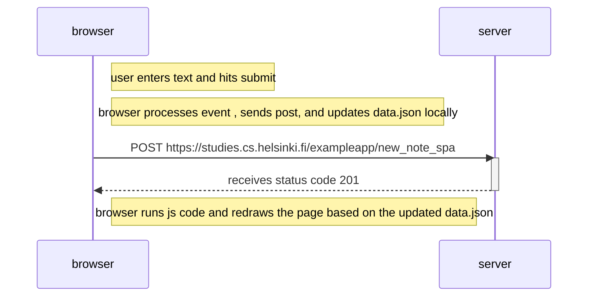

```mermaid
sequenceDiagram
    participant browser
    participant server

    note right of browser: user enters text and hits submit
    note right of browser: browser processes event , sends post, and updates data.json locally
    
    

    browser->>server: POST https://studies.cs.helsinki.fi/exampleapp/new_note_spa
    activate server
    server-->>browser: receives status code 201
    deactivate server
    
    note right of browser: browser runs js code and redraws the page based on the updated data.json
```
